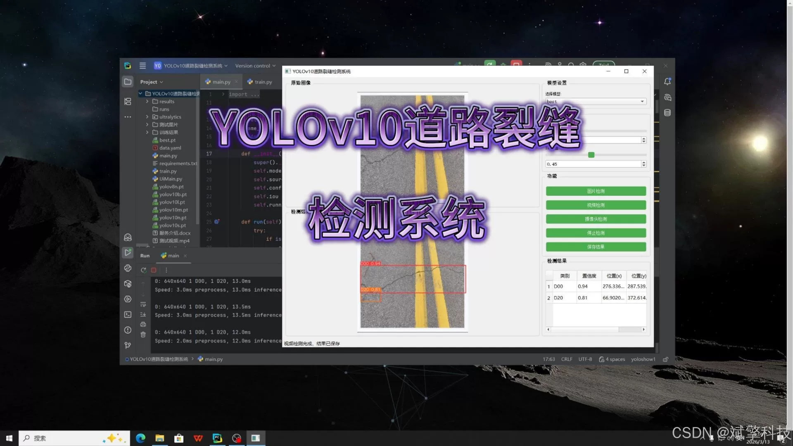
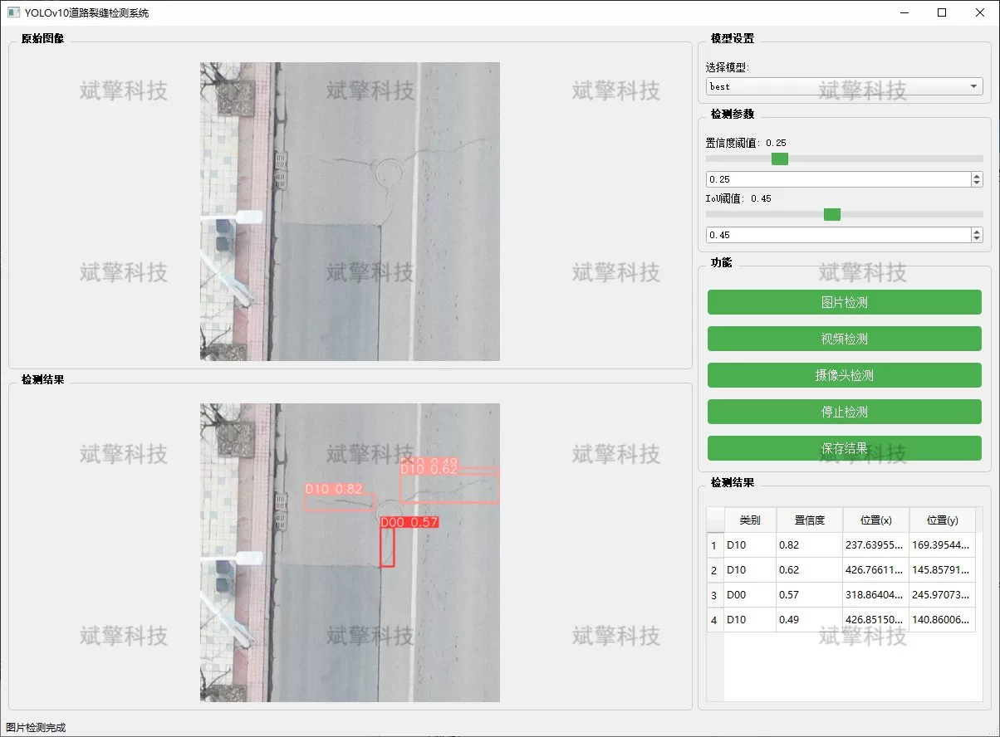
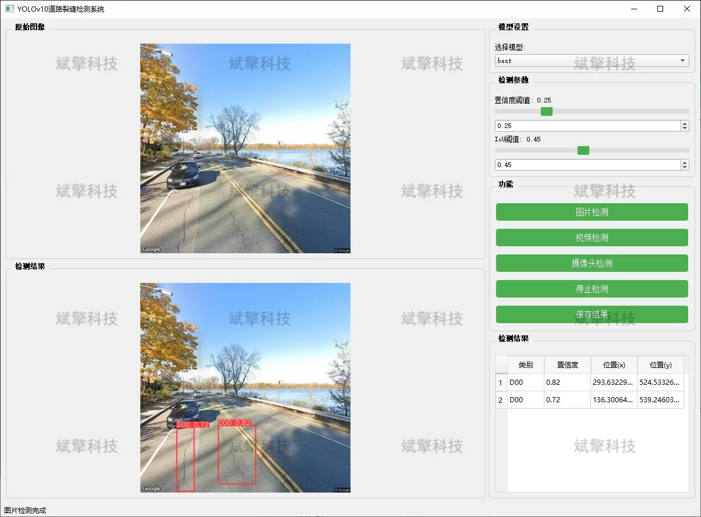
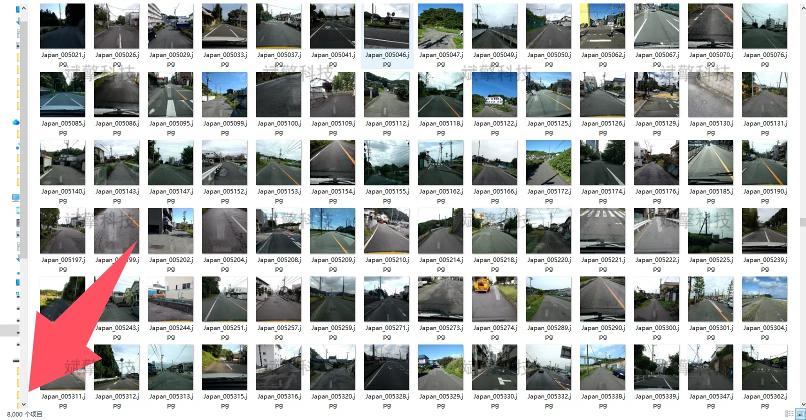
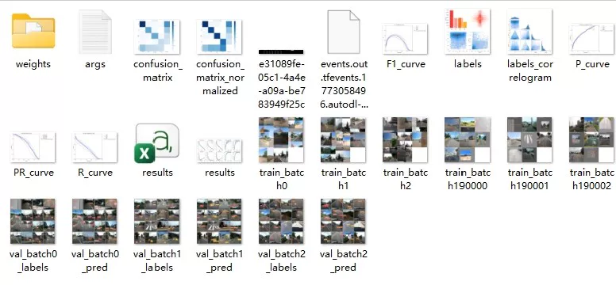
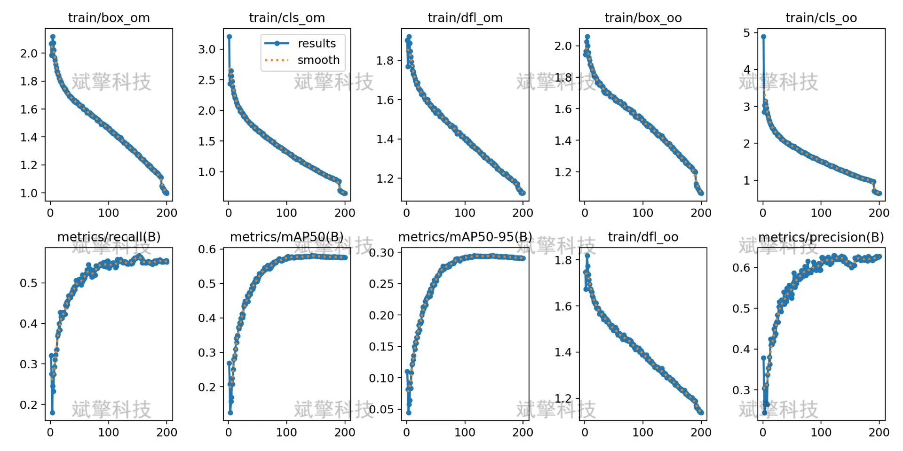
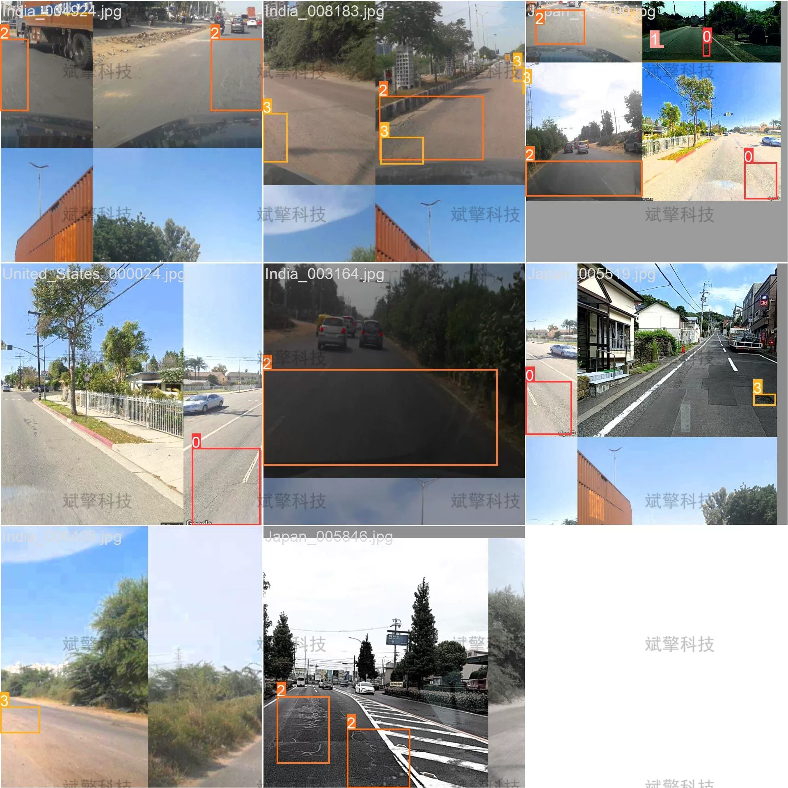
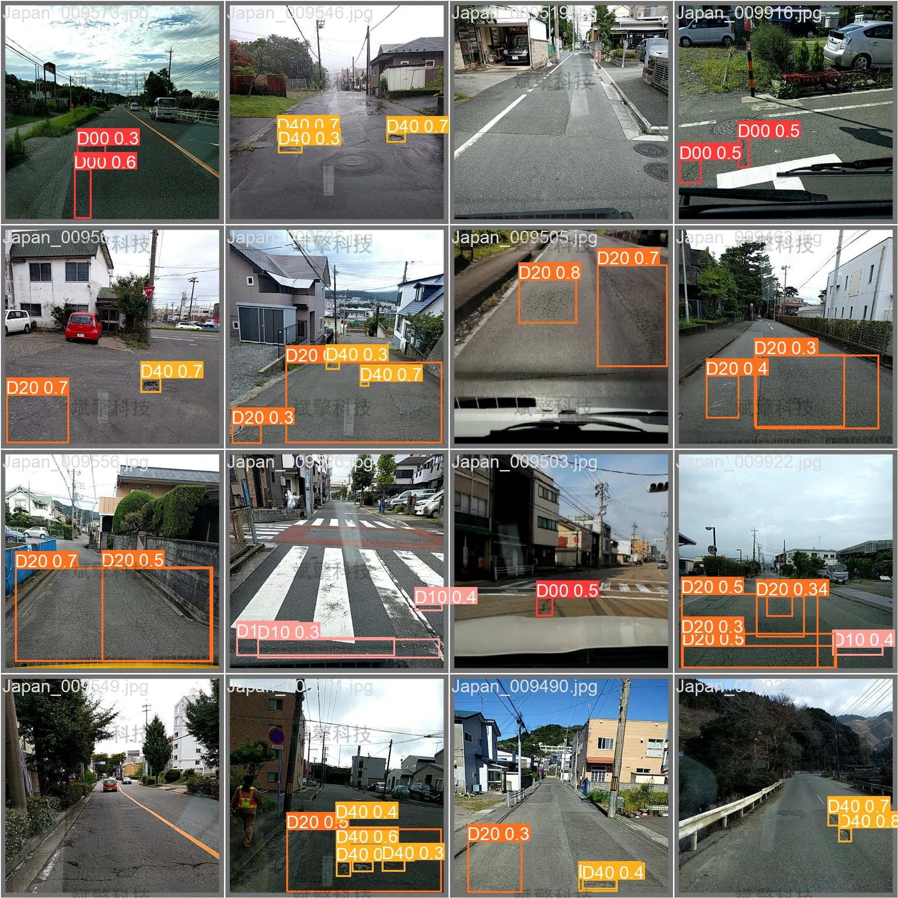

# YOLOv10 Road Crack Detection System

## Body

The YOLOv10 Road Crack Detection System is a deep learning-based intelligent detection system for road cracks based on the YOLOv10 model. This system utilizes the excellent performance of YOLOv10 in the field of object detection, combined with a self-built dataset of road cracks for training and optimization, achieving precise recognition and localization of four common types of road cracks (D00, D10, D20, D40).

To enhance the practicality of the system, we developed a graphical user interface based on PyQt5, integrating three functional modes: image detection, video detection, and real-time camera detection. The system was trained and validated on a dataset containing 10,000 labeled images, and experimental results show that the system performs excellently in terms of detection accuracy and speed, with an average precision mean (mAP) reaching a high level, meeting the needs of actual application scenarios. The development of this system provides a feasible technical solution for the automation of road disease detection, holding significant engineering application value.

System Features
✅ Image Detection: Can detect images and return detection boxes and category information.
✅ Video Detection: Supports input of video files, detecting the situation in each frame of the video.
✅ Real-Time Camera Detection: Connects USB cameras to achieve real-time monitoring.
✅ Parameter Real-Time Adjustment (Confidence and IoU Thresholds)
Dataset Introduction
Training set: 8,000 images (accounting for 80% of the total samples)
Validation set: 2,000 images (accounting for 20% of the total samples)

## Images

## Payment

Here is a pay link on Stripe ( https://buy.stripe.com/3cs8yP7sY87d0vu9AB ). Please contact me lonlonago@foxmail.com after funding $89, and I will send you a complete data files , thank you!

